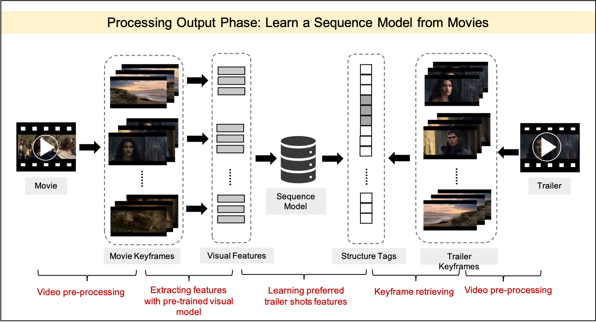
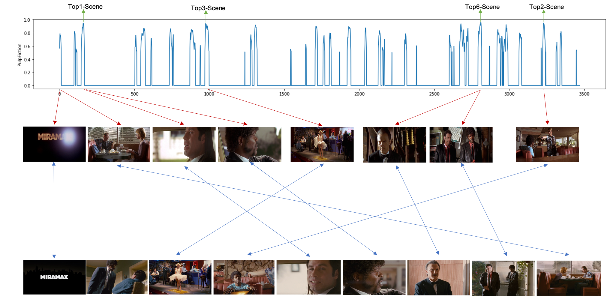

# movie-to-trailer: Automatic Movie Trailer Generation Using Deep Learning

## Overview
Movie trailers are one of the most effective tools for promoting and attracting audiences to films. As trailers gain increasing influence through social media and video-sharing platforms, the process of editing a compelling trailer remains a complex and time-consuming task. This project presents a **supervised learning** approach to assist in **automatic trailer generation** using CNN and LSTM models, reducing the manual effort required by human editors.

## Project Structure

```
movie-to-trailer/
│-- data/               # Contains processed and raw movie & trailer metadata
│-- data_collection/    # Scripts for collecting movie trailers and metadata
│-- pre-processing/     # Scripts for feature extraction and shot boundary detection
│-- data_annotation/    # Tools for automatically predict movie genres and plotkeywords
│-- model/              # Deep learning model for trailer generation
│-- doc/           # Figures and results
│-- README.md           # Project documentation
```

## Features

- **Data Collection:**
  - Collected over 21,000 movie records (top-ranked movies from TMDb) via the [TMDb v3 API](https://pypi.org/project/tmdbv3api/).
  - 15,000 trailers downloaded from YouTube using [YouTube v3 API](https://developers.google.com/youtube/v3).
  - Utilized [MovieNet 1K](https://movienet.github.io/) dataset for temporal modeling.

- **Feature Extraction:**
  - CNN-LSTM model developed:
    - CNN extracts deep visual features from trailer keyframes.
    - LSTM captures temporal relations between trailer and non-trailer shots.

- **Automatic Highlight Detection:**
  - Identifies engaging shots suitable for inclusion in trailers.

- **Genre Classification:**
  - CNN model classifies movies into genres and predicts relevant plot keywords.

- **Evaluation:**
  - AI-generated trailers evaluated against official trailers.

### Process Flow


### Model Architecture

- **CNN:** Extracts deep visual features from keyframes.
- **LSTM:** Models temporal dependencies to identify highlights.

## Technical Specifications

- **Shot Boundary Detection:**
  - Implemented using [PySceneDetect](https://www.scenedetect.com/) based on intensity and HSV color differences.
  - Pre-trained model [TransNetv2](https://github.com/soCzech/TransNetV2) utilized for shot detection.

- **Feature Extraction:**
  - CNN model based on pre-trained [TransNetv2](https://github.com/soCzech/TransNetV2).
  - Pre-trained VGG-16 fine-tuned to predict movie genres and keywords.

- **Scene Matching:**
  - [PyRetri](https://github.com/PyRetri/PyRetri) used to match trailer keyframes with movie keyframes, identifying positive samples.
  - LSTM to model matched trailer keyframes with movie keyframes.

## Process Output Phase



## Results Visualization



*Figure: Comparison of AI-selected clips with official trailer segments.*

## Technical Specifications
- Python PySceneDetect library (https://www.scenedetect.com/) to detect the shot boundaries by analyzing the frame differences based on intensity and color HSV.
- Pre-trained deep network TransNetv2 (https://github.com/soCzech/TransNetV2) for detecting shot transitions for the trailers.
- FFmpeg (https://www.ffmpeg.org/) is used to extract keyframes from each shot, to avoid redundancy 3 keyframes from each shot are extracted.
- Pre-trained VGG-16 (https://www.geeksforgeeks.org/vgg-16-cnn-model/) for extracting visual features, and fine-tuned the model to predict movie genres and keywords.
- PyRetri (https://github.com/PyRetri/PyRetri) for find the matches between trailer keyframes and movie keyframes, and labeled the matched keyframes as positive samples.

## Technical Dependencies

- Python 3.x
- TensorFlow / Keras
- FFmpeg for video processing
- PySceneDetect, TransNetv2, PyRetri libraries
- Pre-trained VGG-16 models for genre and keyword prediction
